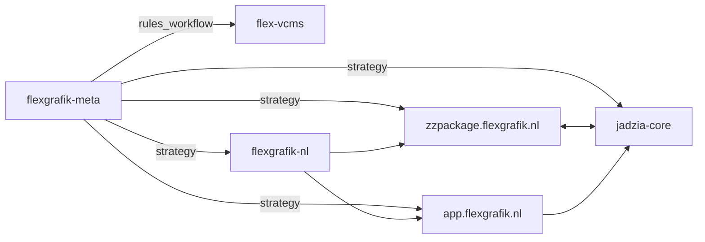

## System diagram

## Where is the truth (canonical pointers)

| Repo | Repo page | Canonical brain | Canonical todo | Guardrails | Handoffs | Vibe-Ready |
|------|----------|------------------|----------------|------------|----------|------------|
| flex-vcms | [open](./repos/flex-vcms) | `brain.md` | `flex-vcms-todo.json` | yes | yes | ✅ READY |
| zzpackage.flexgrafik.nl | [open](./repos/zzpackage-flexgrafik-nl) | `MASTER-BRAIN.md` | `docs/audit-todo.json` | yes | yes | ✅ READY |
| jadzia-core | [open](./repos/jadzia-core) | `brain.md` | `todo.json` | yes | yes | ✅ READY |
| app.flexgrafik.nl | [open](./repos/app-flexgrafik-nl) | `brain.md` | `todo.json` | yes | yes | ✅ READY |
| flexgrafik-nl | [open](./repos/flexgrafik-nl) | `brain.md` | `todo.json` | yes | yes | ✅ READY |
| flexgrafik-meta | [open](./repos/flexgrafik-meta) | `docs/core/master-plan.md` | `todo.json` | yes | yes | ✅ READY |
| agent-os | [open](./repos/agent-os) | `SESSION-ANCHOR.md` | `todo.json` | yes | yes | ✅ READY |
| agent-os-ui | [open](./repos/agent-os-ui) | `README.md` | `todo.json` | yes | yes | ✅ READY |

## Notes
- This map is generated by `node tools/vcms-scan.js`.
- Phase 0 goal is to eliminate ambiguity: one canonical brain/todo per repo.
- `archive/` is intentionally ignored by the scanner (legacy does not participate in conflict detection).
